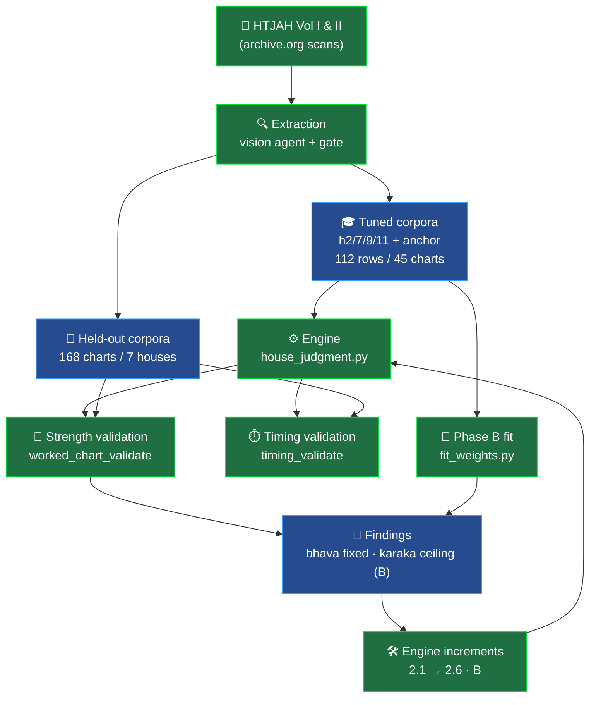
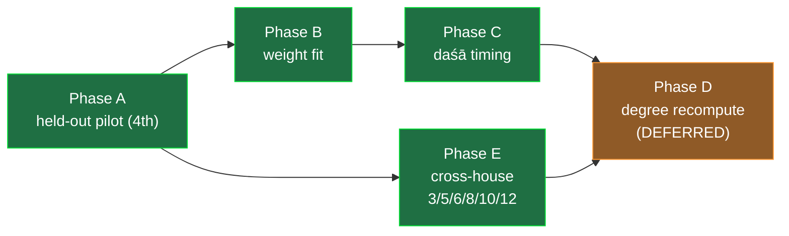
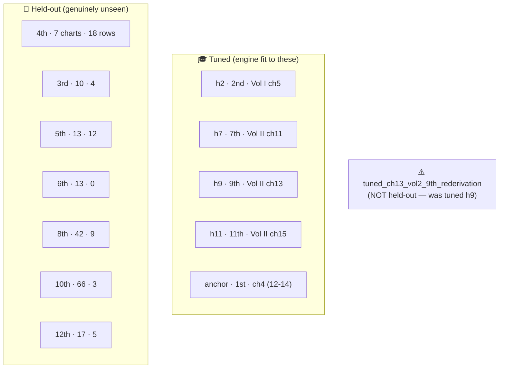

# 🗺️ Medini Doctrine — Map of Content

> [!abstract] What this is
> A single map of the effort to encode **B. V. Raman's _How to Judge a Horoscope_ (HTJAH)**
> Vedic-astrology methodology into an executable strength/timing engine, and to validate it
> **held-out** against Raman's own printed verdicts. Branch `claude/raman-saab-population-validation-3yzklj`, PR #10.

## 🧭 Overview

## 🏛️ Core engine
- [[house_judgment]] — `app/medini/doctrine/domains/house_judgment.py` — the point-scheme:
  `_assess_bhava` / `_assess_planet` → `Finding`s → `_combine` (cross-varga blend +
  `_cap_positive`) → `_verdict_label` on the 9-grade `VERDICT_SCALE`.
- Key knobs: `_W`, `_DIGNITY_W`, `_POS_KNEE`/`_POS_SLOPE`, `_BLEND_W`, `_THRESH`,
  `_RESCUE_KNEE`/`_AFFLICT_FLOOR`.
- Helpers added: [[_bhava_benefic]] / `_natural_benefic` (Phase 2.6).

## 🔁 Validation pipeline
- [[reconstruct]] — `validation/reconstruct.py` — sign-diagram → chart via navāṁśa
  back-solve; the **(rāśi, navāṁśa) reachability gate** (`consistency_errors`) = free
  extraction-error detector.
- [[worked_chart_validate]] — strength harness; pools corpora; pre-registered
  [[verdict_grade_map]] → 9-grade delta.
- [[timing_validate]] — daśā harness ([[Phase C]]); seeds MD/AD from the printed balance,
  reuses `_maha_sequence` / `_antardasha_spans`.
- [[raman-chart-extractor]] — `.claude/agents/…` (superseded in practice by a
  `general-purpose` vision agent for image scans).

## 🚩 Phases

- [[Phase A]] — pilot **Ch VII / 4th house**; built the harness + [[verdict_grade_map]].
- [[Phase B]] — [[fit_weights]]: constrained ordinal fit (sign constraints, anchor hard
  constraint). Bias-free objective → train 79→83%, held-out 50→58%; optimizer independently
  lowered `pos_knee` + `kendra_trikona`. See [[FIT_REPORT]].
- [[Phase C]] — timing: **MD 4/4, AD 4/4 within-one** (AD misses are age-rounding). See [[REPORT_timing]].
- [[Phase D]] — **deferred/exploratory**: `chart_from_birth` + degree features (aspect-orb,
  deep exaltation) to attack the B ceiling; also validates the daśā *balance* end-to-end.
- [[Phase E]] — cross-house held-out over all non-tuned houses. See [[REPORT_crosshouse_heldout]].

## 🛠️ Engine increments (held-out-driven)
| # | name | effect | note |
|---|---|---|---|
| 2.1 | occupant dignity in bhāva | exalted/own/debil occupant colours the house | |
| 2.2 | no-phantom-frame blend | un-assessed varga can't rescue an afflicted one | |
| 2.3 | dignity-aware bhāva aspects | exalted planet aspecting → conjunct-exalted credit | |
| 2.4 | dusthāna-lord penalty | a 6/8/12 lord is a functional malefic to *itself* | held-out ch64 |
| 2.5 | mild frame can't rescue deep affliction | gated 30% blend discount | ch71 +3→+2 |
| **2.6 A.1** | [[natural-benefic occupant]] | natural benefic ≠ blemish even if functional malefic | ch72 −4→−1, ch74 −2→**0** |
| **2.6 A.2** | [[natural-benefic aspect + kartari]] | same for aspects/hemming; false papakartari suppressed | ch70 −2→**0**, ch73 −4→−3 |
| **8 (B)** | [[kāraka over-credit ceiling]] | **NOT closable** on sign-only features (documented negative result) | see below |

> [!warning] The B ceiling
> A kendra/dignity placement offsets stacked malefic testimony where Raman says
> **afflicted**. Blanket `pos_knee` cut breaks the anchor (8/8→5/8); a "malefic-siege"
> penalty doesn't separate (anchor ch14 kāraka siege=2→moderate vs held-out ch70 siege=2→
> afflicted). Needs degree features ([[Phase D]]) — a re-weighting won't do it.

## 📚 Corpora

- Tuned: `docs/raman_doctrine/audit/corpora/*.json` — houses **1/2/7/9/11**.
- Held-out: `docs/raman_doctrine/validation/corpora/heldout_ch{06,07,08,09,12,14,16}_*.json`.
- [[tuned_ch13_vol2_9th_rederivation]] — the **retracted** "cross-house" set (train/test-wall fix).

## 📄 Reports
- [[REPORT_ch07_4th]] · [[REPORT_ch06_3rd]] · [[REPORT_ch08_5th]] · [[REPORT_ch09_6th]] ·
  [[REPORT_ch12_8th]] · [[REPORT_ch14_10th]] · [[REPORT_ch16_12th]]
- [[REPORT_crosshouse_heldout]] — the pooled 7-house number.
- [[REPORT_timing]] — daśā/timing.
- [[FIT_REPORT]] — Phase B.
- [[HOUSE_SCHEME_AUDIT]] — the increment ledger (2.1 → B).

## 🔬 Headline findings
> [!success] What held
> - **2.6 A.1/A.2** closed the bhāva side: Ch VII within-one **39% → 56%**, zero tuned/anchor cost.
> - **Cross-house held-out (Phase E): 168 charts → 51 rows / 7 houses, within-one 47%.**
> - The **kāraka over-credit replicates across 7 houses & 5 kārakas** (ch69 Saturn +6, ch59 +5,
>   ch70 +3, ch98 Jupiter +3) — structural, not a 4th-house artifact.
> - **Timing** arithmetic is correct (MD 4/4, AD within-one 4/4).

> [!failure] Honest limits
> - The **kāraka ceiling (B)** is not closable on sign-only features.
> - Raman's **soft/outcome verdict language** (6th/10th/12th) — not chart supply — caps the
>   scoreable rows (168 charts → 51 rows).
> - One data-integrity slip (tuned 9th mislabeled held-out) — **caught & corrected**.

## 🧪 Tests (guards)
`tests/doctrine/` — `test_house_judgment` (increments), `test_worked_chart_validate`
(gate + A.1/A.2), `test_fit_weights` (Phase B), `test_timing_validate` (Phase C). **245 pass.**

## 🌳 Timeline (commit arc)
held-out pipeline → 2.1–2.5 increments → Phase B fit → 2.6 A.1 → A.2 → B ceiling →
Phase C timing → **integrity correction** → Phase E (6 non-tuned houses) → cross-house summary.

## ➡️ Open next steps
- [[Phase D]] degree recompute (the only shot at B + validates the daśā balance).
- Backfill Phase-E balance lines into the [[timing_validate]] corpus.
- Extend [[verdict_grade_map]] to reclaim soft-verdict rows (would unlock ~117 retained charts).
